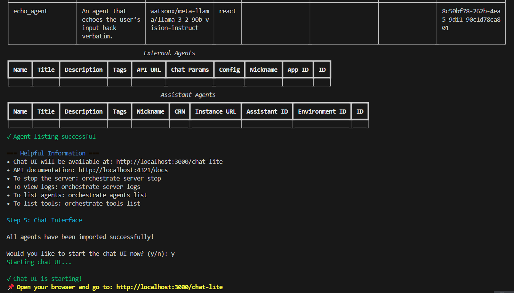
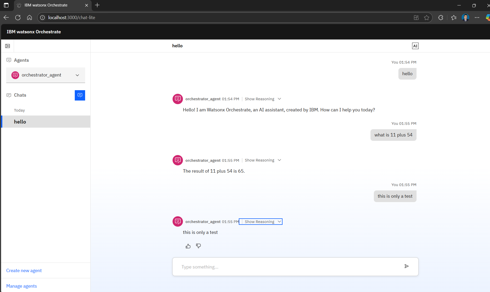

# 🖐️ Hello Watsonx Orchestrate

A minimal, fully-working **multi-agent demo** for the  
[IBM watsonx-Orchestrate ADK](https://developer.watson-orchestrate.ibm.com).

> **Agents included**
> 1. `greeting_agent` – answers any greeting  
> 2. `echo_agent` – repeats whatever the user says  
> 3. `calculator_agent` – performs addition by calling a Python tool  
> 4. `orchestrator_agent` – routes every request to the right specialist  
> 5. `add` tool – a registered Python function used by `calculator_agent`

---

✅ Prerequisites
Before you dive in, please ensure your environment meets the following requirements:

1. Operating System: A UNIX-based operating system is required, such as macOS or a popular Linux distribution like Ubuntu.

2. Container Environment: You'll need Docker or a compatible alternative like Colima installed and running. The development server operates within a container, making this a crucial component.

3. IBM Cloud Account: An active IBM Cloud account is necessary to access the required watsonx services and resources.

## ✨ Quick start (5 commands)

```bash
git clone https://github.com/ruslanmv/hello-watsonx-orchestrate.git
cd hello-watsonx-orchestrate

bash install.sh                 # venv → pip install → start server → import all

````


Open the URL printed in the terminal and try:

| User input            | Expected answer (agent path)                           |
| --------------------- | ------------------------------------------------------ |
| `hello`         | **Hello! I am Watsonx Orchestrate, an AI assistant, created by IBM. How can I help you today?** (Tool: greeting_agent)          |
| `what is 11 plus 54`  | **The result of 11 + 54 is 65.** (Tool: calculator_agent)   |
| `this is only a test` | **this is only a test.**(Tool: echo_agent) |





---

## 📂 Project layout

```
.
├── agents/              # YAML definitions
│   ├── greeting_agent.yaml
│   ├── echo_agent.yaml
│   ├── calculator_agent.yaml
│   └── orchestrator_agent.yaml
├── tools/
│   └── calculator_tool.py
├── tests/               # pytest sample
│   └── test_router.py
├── install.sh             # one-shot bootstrap script
├── requirements.txt
├── .gitignore
├── LICENSE
└── README.md
```

---

## 🧪 Running tests locally

```bash
source venv/bin/activate             # if not already
pytest -q
```

CI (GitHub Actions) automatically validates the YAML and runs the same tests on every push / PR.

---

## 🛠 Troubleshooting

| Symptom                        | Fix                                                                                                              |
| ------------------------------ | ---------------------------------------------------------------------------------------------------------------- |
| `tool 'add' not found`         | Run `orchestrate tools list` – if empty, re-run `setup.sh` (tools must be imported **before** agents).           |
| `Address already in use :8080` | Another Orchestrate server is running. `orchestrate server stop` first, or kill the container in Docker Desktop. |
| Chat page 404                  | Ensure `orchestrate server start --accept-license` is still running in a terminal tab.                           |

Additional Troubleshootings [here](docs/Troubleshootings.md)

---

## 🤝 Contributing

Pull requests and issues welcome! Please run `pytest` and ensure CI passes before submitting.

---

## 📝 License

This repository is released under the MIT License (see [LICENSE](LICENSE)).
