## 🚀 **From Zero to Hero: Building a Multi-Agent System with Watsonx Orchestrate**

### **Introduction**

Welcome to the world of AI agents\! In this tutorial, you'll learn how to build a **multi-agent system**. Instead of a single, monolithic AI, we will create a team of specialized agents that collaborate to solve problems. Our system will have:

  * **Greeting Agent**: A specialist for handling greetings.
  * **Echo Agent**: A simple agent that repeats any general message.
  * **Calculator Agent**: A powerful agent that can perform math using a Python tool.
  * **Orchestrator Agent**: The "manager" agent that receives all user requests and decides which specialist should handle the task.

This "manager-worker" pattern is fundamental to creating sophisticated and reliable AI systems. Let's get started\!

### **✅ Prerequisites**

Before you begin, make sure you have the following:

1.  **Python 3.8+**: Ensure Python and `pip` are installed and accessible from your command line.
2.  **Docker**: The ADK development server runs in a Docker container, so you must have Docker Desktop or another container environment (like Colima) installed and running.
3.  **IBM Cloud Account (Optional)**: While the local server runs with offline "stub" models, connecting to `watsonx.ai` gives you access to powerful LLMs like Llama 3. If you choose to connect, you'll need a project and an API key.

-----

### **🛠️ Step 1: Project Setup**

To make things easier, all the code for this tutorial is ready for you. Let's clone the repository and set up a clean Python environment.

1.  **Clone the Project Files**
    Open your terminal and run the following command to download all the necessary YAML and Python files.

    ```bash
    # This is a placeholder URL for the example.
    git clone https://github.com/example/hello-watsonx-orchestrate.git
    cd hello-watsonx-orchestrate
    ```

2.  **Create and Activate a Virtual Environment**
    A virtual environment keeps your project's dependencies isolated.

    *On macOS / Linux:*

    ```bash
    python3.11 -m venv venv
    source venv/bin/activate
    ```

    *On Windows (Command Prompt):*

    ```bash
    python -m venv venv
    venv\Scripts\activate.bat
    ```


#Variable ENviroments


There are different ways to configure the .env file for watsonx Orchestrate Developer Edition and clarify the credential requirements.


.env File Configuration Options
There are three main ways to configure your .env file for the local watsonx Orchestrate Developer Edition:

Option 1: Using watsonx.ai Account (Recommended for Local Development)
# watsonx Orchestrate Developer Edition Configuration
WO_DEVELOPER_EDITION_SOURCE=myibm
WO_ENTITLEMENT_KEY=<your_entitlement_key_from_myibm>
WO_DEVELOPER_EDITION_SKIP_LOGIN=false

# watsonx.ai Configuration
WATSONX_APIKEY=<your_watsonx_api_key>
WATSONX_SPACE_ID=<your_space_id>
WATSONX_URL=https://us-south.ml.cloud.ibm.com

Option 2: Using watsonx Orchestrate Account (Version 1.5.0+)
# watsonx Orchestrate Developer Edition Configuration
WO_DEVELOPER_EDITION_SOURCE=orchestrate
WO_INSTANCE=<your_service_instance_url>
WO_API_KEY=<your_wxo_api_key>

Option 3: Hybrid Approach (Fallback Method)
# watsonx Orchestrate Developer Edition Configuration
WO_DEVELOPER_EDITION_SOURCE=myibm
WO_ENTITLEMENT_KEY=<your_entitlement_key>
WO_INSTANCE=<your_service_instance_url>
WO_API_KEY=<your_wxo_api_key>
WO_DEVELOPER_EDITION_SKIP_LOGIN=false

For Local Development (Your Use Case)
Since you want to use the local version, I recommend Option 1 with watsonx.ai credentials:

# watsonx Orchestrate Developer Edition Configuration
WO_DEVELOPER_EDITION_SOURCE=myibm
WO_ENTITLEMENT_KEY=<get_from_myibm.ibm.com>
WO_DEVELOPER_EDITION_SKIP_LOGIN=false

# watsonx.ai Configuration  
WATSONX_APIKEY=<your_watsonx_api_key>
WATSONX_SPACE_ID=<your_space_id>
WATSONX_URL=https://us-south.ml.cloud.ibm.com

Can You Use Another User's Credentials?
Yes, you can use different credentials, but with considerations:
watsonx.ai Credentials: You can use any valid watsonx.ai account - it doesn't have to be the same as your watsonx Orchestrate account. The watsonx.ai credentials are used for:

Pulling Docker images for the Developer Edition
Accessing LLM models (if you use watsonx/* models)
Entitlement Key: You can use any valid IBM entitlement key that has access to watsonx products

Important Notes:

Legal/Licensing: Make sure you have proper licensing rights to use the credentials
Access Control: The person whose credentials you use needs appropriate access to watsonx.ai services
Cost: Usage will be billed to the account whose credentials you use
How to Get the Required Values
For WO_ENTITLEMENT_KEY:
Go to My IBM
Click View Library
Click Add a new key +
Copy the entitlement key
For WATSONX_APIKEY and WATSONX_SPACE_ID:
Go to IBM Cloud watsonx.ai
Create a watsonx.ai instance (if you don't have one)
Get your API key from IBM Cloud (Account → Manage → Access (IAM) → API keys)
Get your Space ID from the Developer access page
Complete .env File Example for Local Development:
# watsonx Orchestrate Developer Edition Configuration
WO_DEVELOPER_EDITION_SOURCE=myibm
WO_ENTITLEMENT_KEY=eylkjlkjsdlkjIsInR5cCI6IkpXVCJ9...
WO_DEVELOPER_EDITION_SKIP_LOGIN=false

# watsonx.ai Configuration
WATSONX_APIKEY=your-ibm-cloud-api-key-here
WATSONX_SPACE_ID=12345678-1234-1234-1234-123456789abc
WATSONX_URL=https://us-south.ml.cloud.ibm.com

Starting the Server:
orchestrate server start --env-file=.env

Key Points:
For local development, you primarily need the WO_DEVELOPER_EDITION_* variables to pull and run the Docker images
WATSONX_* variables are needed if you want to use watsonx/* LLM models in your agents
You can use credentials from different IBM accounts as long as they have the necessary permissions
WO_INSTANCE and WO_API_KEY are only needed if you plan to sync with a remote watsonx Orchestrate instance later
Your current template is correct - just fill in the actual values based on the credentials you have access to.

WATSONX_APIKEY requires WATSONX_SPACE_ID to be set. The combination of WATSONX_APIKEY with WATSONX_PROJECT_ID alone is not supported in this configuration.

Step-by-Step Guide to Get Your WATSONX_SPACE_ID
Step 1: Access IBM Cloud
Go to [IBM Cloud](https://cloud.ibm.com/)
Log in with your IBM Cloud credentials
Step 2: Navigate to watsonx.ai
From the IBM Cloud dashboard, search for "watsonx.ai" in the search bar
Click on your watsonx.ai service instance
Or directly go to the [Developer access page](https://dataplatform.cloud.ibm.com/developer-access?context=wx)
Step 3: Find Your Space ID
Option A: Through Developer Access Page

Go to [Developer access](https://dataplatform.cloud.ibm.com/developer-access?context=wx) page on IBM Cloud
Look for the "Space ID" section
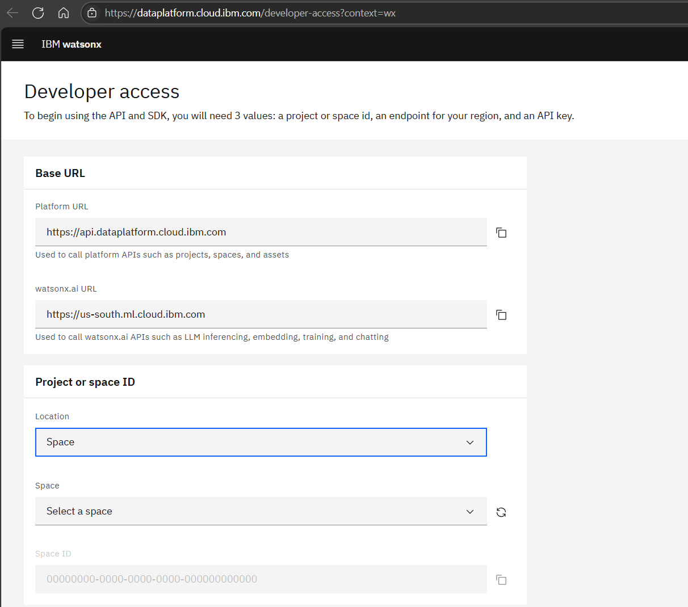
If you dont have space you can create a one.


Step 2: Check Space Permissions
In watsonx.ai, go to "Spaces"
Find the space that you have created
Click on the space to open it
Go to "Manage" or "Access control" tab
Check if your user/service ID has proper permissions
Step 3: Add Permissions to the Space
In the space's Access control section
Click "Add collaborators" or "Manage access"
Add your user account with "Admin" or "Editor" role
If you are using for example TechZone you can
Add access groups as collaborators
Save the changes
Step 4: Verify API Key Permissions
Go to IBM Cloud IAM
Find your API key (the one in your .env file)
Click on it to view details
Ensure it has the following permissions:
Watson Machine Learning service access
Watson Studio service access
Resource group access where your watsonx.ai instance is located
Step 5: Create a New Space (Alternative Solution)
If you can't access the existing space, create a new one:

In watsonx.ai, go to "Spaces"
Click "Create a space"
Give it a name (e.g., "My Development Space")
Add a description
Click "Create"
Copy the new Space ID
Step 6: Update Your .env File
Update your .env file with the correct Space ID:


Copy the Space ID value
Option B: Through watsonx.ai Interface

In your watsonx.ai instance, look for "Spaces" in the navigation
Click on your existing space or create a new one
The Space ID will be visible in the space details or URL
Option C: Create a New Space (if you don't have one)

In watsonx.ai, go to "Spaces"
Click "Create a space"
Give it a name and description
Once created, note down the Space ID
Step 4: Update Your .env File
Replace your current configuration with:

# watsonx Orchestrate Developer Edition Configuration
WO_DEVELOPER_EDITION_SOURCE=myibm
WO_ENTITLEMENT_KEY=
WO_DEVELOPER_EDITION_SKIP_LOGIN=false

# watsonx.ai Configuration
WATSONX_APIKEY=
WATSONX_SPACE_ID=<your_actual_space_id_here>
WATSONX_URL=https://us-south.ml.cloud.ibm.com

Remove the PROJECT_ID line entirely and replace <your_actual_space_id_here> with the actual Space ID you obtained.

Step 5: Restart Your Environment
Stop the current server:

orchestrate server stop

Start the server with your updated .env file:

orchestrate server start --env-file=path/to/your/.env

Activate the local environment:

orchestrate env activate local

Alternative: Use watsonx Orchestrate Credentials Instead
If you continue having issues with watsonx.ai credentials, you can use your watsonx Orchestrate credentials instead (if you have a watsonx Orchestrate account):

# watsonx Orchestrate Developer Edition Configuration
WO_DEVELOPER_EDITION_SOURCE=orchestrate
WO_INSTANCE=<your_service_instance_url>
WO_API_KEY=<your_wxo_api_key>

Why This Happens
The watsonx Orchestrate Developer Edition requires either:

watsonx.ai credentials: WATSONX_APIKEY + WATSONX_SPACE_ID
watsonx Orchestrate credentials: WO_INSTANCE + WO_API_KEY
The system doesn't support mixing WATSONX_APIKEY with PROJECT_ID because spaces and projects have different access patterns and permissions in watsonx.ai.


Models Compatible with Function Calling
Based on the watsonx Orchestrate ADK documentation, here are the models that support function calling (tools):

IBM Granite Models (Recommended)
watsonx/ibm/granite-3-8b-instruct
watsonx/ibm/granite-3-2b-instruct
watsonx/ibm/granite-3-8b-instruct (latest version)
Meta Llama Models
watsonx/meta-llama/llama-3-3-70b-instruct
watsonx/meta-llama/llama-3-1-70b-instruct
watsonx/meta-llama/llama-3-1-8b-instruct
watsonx/meta-llama/llama-3-2-90b-vision-instruct
Other Compatible Models
watsonx/mistralai/mixtral-8x7b-instruct-v01
watsonx/mistralai/mistral-large
How to Check Available Models
You can list all available models in your environment:


### **⚙️ Step 2: Install and Configure the ADK**

Now, we'll install the IBM watsonx Orchestrate Agent Developer Kit (ADK) and start the local development server.

1.  **Install the ADK**
    Use `pip` to install the core `orchestrate` library.

    ```bash
    pip install --upgrade ibm-watsonx-orchestrate==1.6.2
    ```

2.  **Activate and Start the Local Server**
    The ADK's local server runs in Docker and provides an offline environment for development.

   Let's test the installation

    ```bash
   orchestrate --version
    ```
    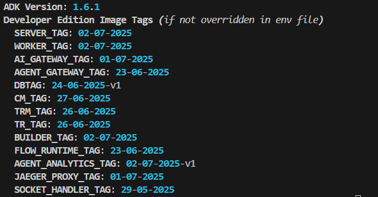


    In this demo we are going to use the the watsonx Orchestrate Developer Edition runs under a Docker container, and can’t be used to host a full working version of watsonx Orchestrate. 
    The server runs under the host machine’s localhost, and can’t be used to provide remote access. 

    Deploying the watsonx Orchestrate Developer Edition in a virtual machine is also not supported.


Install Docker and Docker Compose engine. It is containerization engine used to install the watsonx Orchestrate Developer Edition. For more information, see Docker and Docker compose.


For macOS users, use a container management software such as Rancher Desktop or Colima to use the Docker engine.


You must have access to at least one of these services:

watsonx Orchestrate
watsonx.ai
You can use at least one of these services to get access to the watsonx Orchestrate Developer Edition images.


Setup the environment
The watsonx Orchestrate Developer Edition is distributed as a Docker image. In order to pull the images from Docker, you must configure an environment file with the appropriate data.


Getting an entitlement key for watsonx Orchestrate Developer Edition
You can download the images if you have a valid instance of watsonx.ai. In order to do that, you must obtain an entitlement key to proceed. To get the entitlement key, follow these steps:

Access My IBM.

Click View Library.

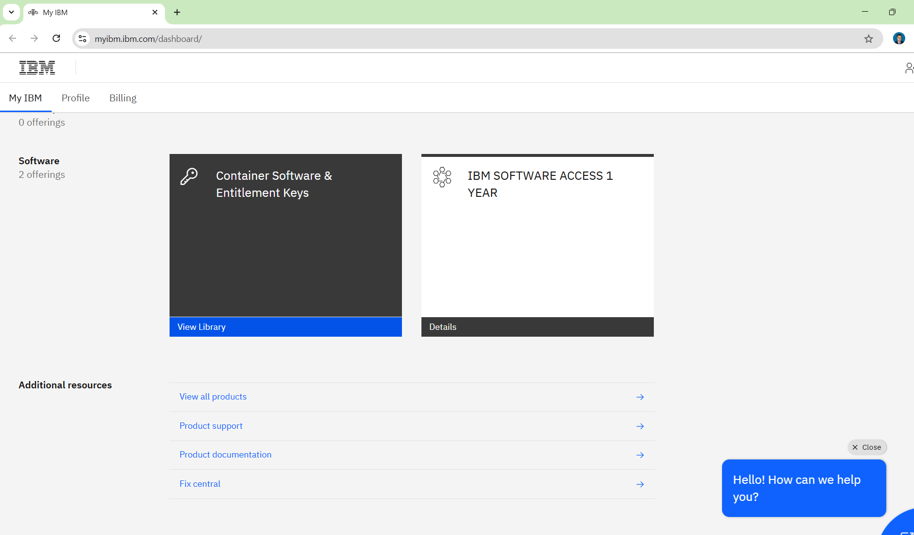


Click Add a new key +.

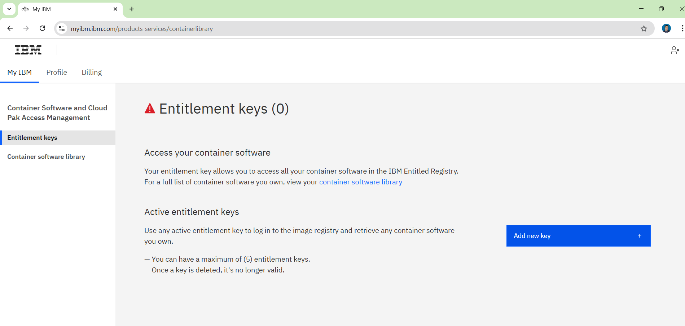
Copy the entitlement key.
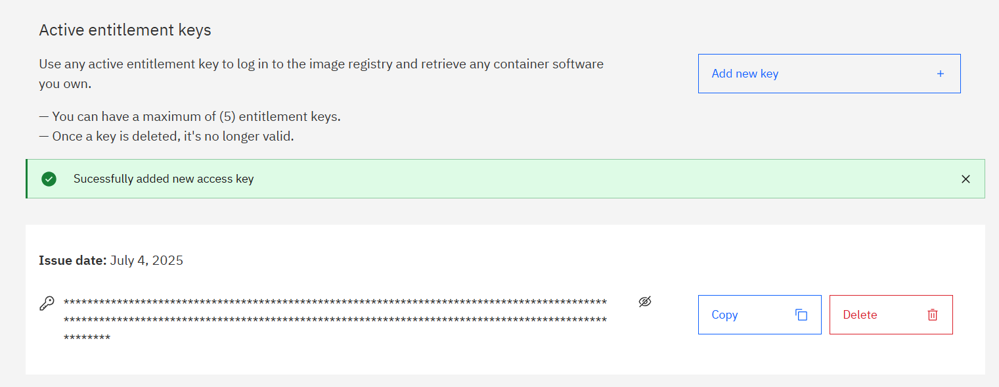


Using your watsonx.ai account
Create a watsonx.ai instance on IBM Cloud, if you do not have one already, and locate your space ID. You can create a new instance and get the space ID in the Developer access page on IBM Cloud.
Go to this page
[Developer access ](https://dataplatform.cloud.ibm.com/developer-access?context=wx)


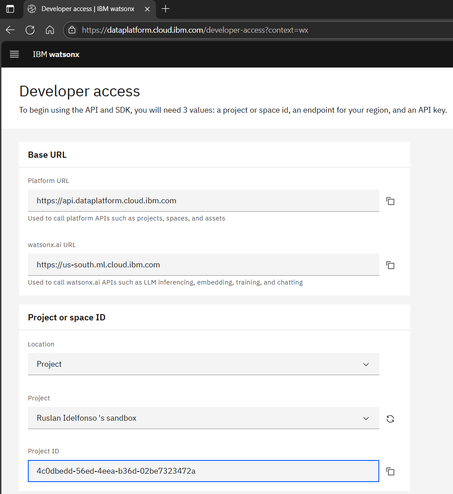


To get your API Key, see[Managing API Keys](https://cloud.ibm.com/docs/account?topic=account-userapikey&interface=ui).

Create you personal API KEY
[https://cloud.ibm.com/iam/apikeys](https://cloud.ibm.com/iam/apikeys)
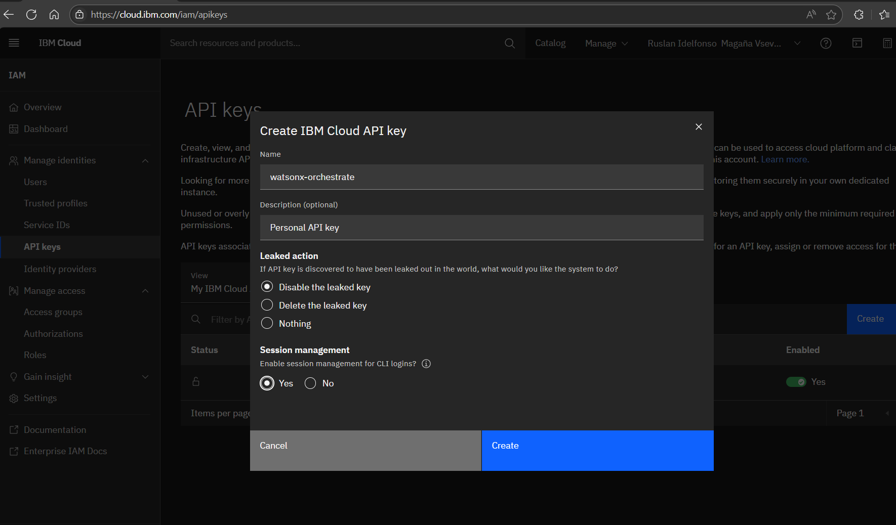
and copy it


    Create a .env file with the following contents:
    ```bash
  WO_DEVELOPER_EDITION_SOURCE=myibm
  WO_ENTITLEMENT_KEY=<my_entitlement_key>
  WATSONX_APIKEY=<my_watsonx_api_key>
  WATSONX_SPACE_ID=<my_space_id>
  WO_DEVELOPER_EDITION_SKIP_LOGIN=false
    ```

    ```bash
    # Point the CLI to your local environment
    orchestrate env activate local

    # Start the server and accept the license
    orchestrate server start --accept-license
    ```

    **Important**: Keep this terminal window open\! The server must be running for your agents to work. If you accidentally close it, simply run the `orchestrate server start --accept-license` command again in a new terminal.


If you want get an online watsonx orchestrate you can try the trial
Trial access on IBM Cloud.
IBM Cloud

To initiate the trial access on IBM Cloud:

[Log in](https://cloud.ibm.com/login) to your IBM Cloud account.
If you don't have an account, create an [IBM Cloud account](https://cloud.ibm.com/registration). Complete the registration form, and click Create account.
Navigate to the [watsonx Orchestrate catalog](https://cloud.ibm.com/catalog/services/watsonx-orchestrate?catalog_query=aHR0cHM6Ly9jbG91ZC5pYm0uY29tL2NhdGFsb2cjYWxsX3Byb2R1Y3Rz) page on IBM Cloud.
On the plan catalog page, select Trial plan and choose your data center location from the Select a location drop-down.
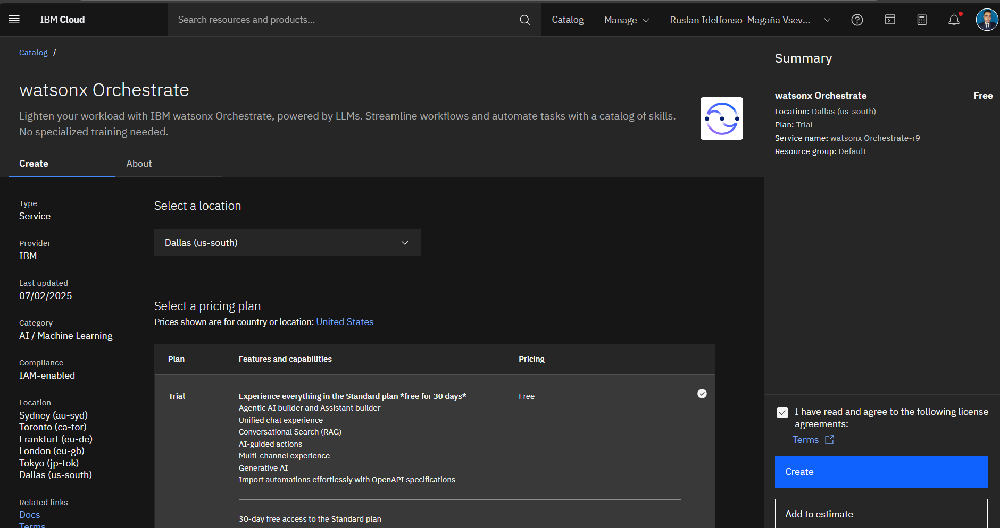


The Service name is pre-filled, you can modify it if needed.
The resource group is set to Default.
Accept the license agreement and click Create to provision a watsonx Orchestrate instance on IBM Cloud. The services page is displayed.
Click Launch watsonx Orchestrate to access the service page and start using the service.
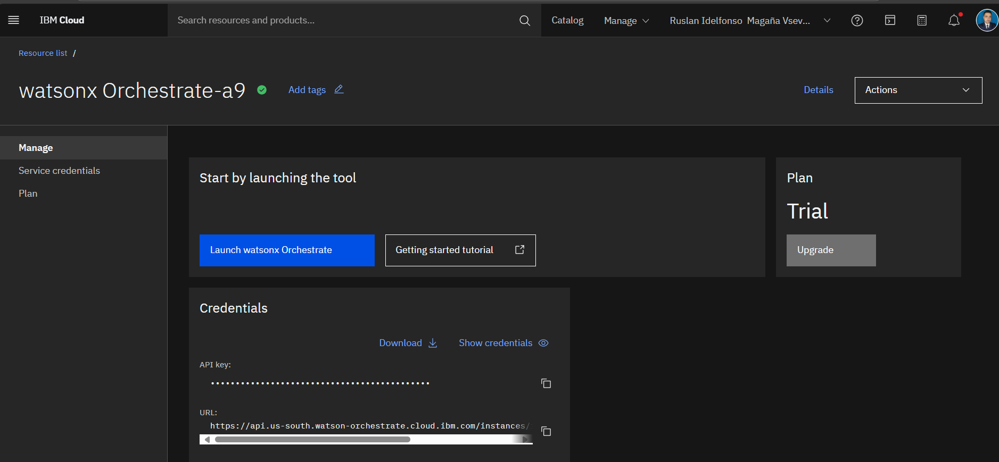


https://us-south.watson-orchestrate.cloud.ibm.com/chat

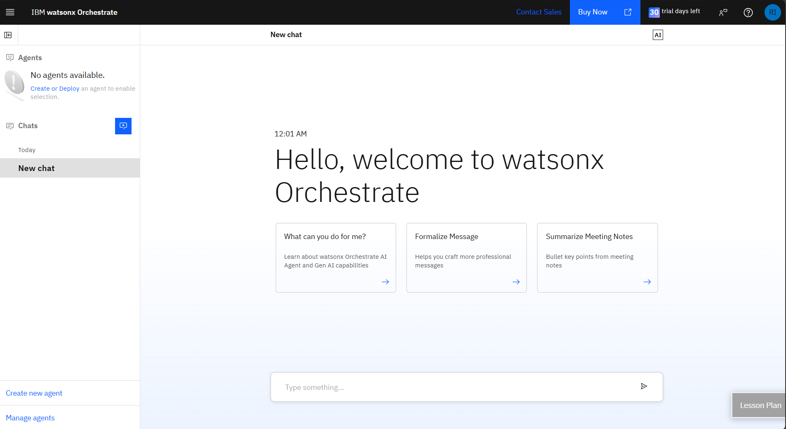


 There are different ways to use watson orchestrate, more information [here](https://www.ibm.com/docs/en/watsonx/watson-orchestrate/base?topic=orchestrate-logging-in-watsonx)

 Using your watsonx Orchestrate account
Starting at version 1.5.0, you can now use your watsonx Orchestrate account to pull images from Docker, and you no longer need an entitlement key to pull the images.

[Log in](https://www.ibm.com/docs/en/watsonx/watson-orchestrate/current?topic=orchestrate-logging-in-watsonx) to your watsonx Orchestrate account.

Click your user profile and open the Settings page.

Open the API details tab and click Generate API key.
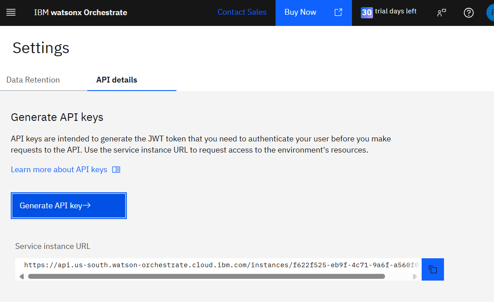


Installing the watsonx Orchestrate Developer Edition with ADK

To install the watsonx Orchestrate Developer Edition with the ADK, run the following command in the CLI:

```bash
orchestrate server start --env-file={{The path of your .env file}}
```

for example

orchestrate server start --env-file=/mnt/c/blog/hello-watsonx-agents/.env
-----

### **🤖 Step 3: Create and Validate Your Agents**

The project you cloned contains all the agent definitions. Let's review them and learn how to validate them before use.

A best practice is to run `orchestrate validate -f <your-file.yaml>` before importing anything. This command checks for typos, incorrect model IDs, and other common errors.

#### **Agent 1: The Greeting Agent (`greeting_agent.yaml`)**

This agent's only job is to respond to greetings. Note the instructions are written to be case-insensitive.

```yaml
# greeting_agent.yaml
spec_version: v1
kind: native
name: greeting_agent
description: A friendly agent that handles greetings.
llm: watsonx/meta-llama/llama-3-8b-instruct
instructions: |
  If the user's message contains the word "hello" (case-insensitive), you MUST respond with: "Hello! I am the Greeting Agent."
tools: []
```

*Validate it:* `orchestrate validate -f greeting_agent.yaml`

#### **Agent 2: The Echo Agent (`echo_agent.yaml`)**

This agent echoes any input back, using the correct `{input}` placeholder for the user's message.

```yaml
# echo_agent.yaml
spec_version: v1
kind: native
name: echo_agent
description: An agent that echoes back the user's message.
llm: watsonx/meta-llama/llama-3-8b-instruct
instructions: |
  Your task is to repeat the user's exact input back to them.
  You MUST respond with the format: "The Echo Agent heard you say: {input}"
tools: []
```

*Validate it:* `orchestrate validate -f echo_agent.yaml`

#### **The Collaborator Pattern**

The Orchestrator Agent will manage our other agents. It uses the `collaborators` keyword to gain access to them. The message flow looks like this:

```ascii
     User Input
          │
          ▼
┌────────────────────┐
│ Orchestrator Agent │
└────────────────────┘
          │
          ├─► If "hello" is in message... ─► ┌────────────────┐
          │                                  │ Greeting Agent │
          │                                  └────────────────┘
          │
          ├─► If message is math... ────────► ┌──────────────────┐
          │                                  │ Calculator Agent │
          │                                  └──────────────────┘
          │
          └─► Otherwise... ─────────────────► ┌──────────────┐
                                             │  Echo Agent  │
                                             └──────────────┘
```

#### **Agent 3: The Orchestrator Agent (`orchestrator_agent.yaml`)**

This is the brain of our system. It contains the routing logic to delegate tasks to the correct specialist.

```yaml
# orchestrator_agent.yaml
spec_version: v1
kind: native
name: orchestrator_agent
description: Routes user requests to the appropriate specialist agent.
style: react
llm: watsonx/ibm/granite-13b-instruct-v2
collaborators:
  - "greeting_agent"
  - "calculator_agent" 
  - "echo_agent"
instructions: |
  You are the Orchestrator Agent. Delegate as follows:

  1. If the user's message contains the word "hello" (case-insensitive),
     delegate to greeting_agent and return their exact response.

  2. Else if the message appears to ask for an addition or uses keywords
     like "add", "plus", "sum", or contains a pattern "<number> + <number>",
     delegate to calculator_agent and return their exact response.

  3. Otherwise, delegate to echo_agent and return their exact response.

  Always delegate to a collaborator. Do not answer directly yourself.
tools: []
```

*Validate it:* `orchestrate validate -f orchestrator_agent.yaml` (This will fail for now, as it doesn't know about `calculator_agent` yet. We'll fix that next\!)

-----

### **🦸 Step 4: The "Hero" Leap - Empowering Agents with Python Tools**

Agents that only talk are useful, but agents that *do things* are powerful. Here’s how we create our `calculator_agent`. **Order is critical**: we must create and import the tool *before* the agent that uses it.

#### **4.1: Create the Python Tool (`calculator_tool.py`)**

The ADK requires the `@tool` decorator to discover and register a Python function.

```python
# calculator_tool.py
from ibm_watsonx_orchestrate.agent_builder.tools import tool

@tool
def add(a: float, b: float) -> float:
    """
    Add two numbers together.
    
    :param a: The first number to add
    :param b: The second number to add
    :returns: The sum of a and b
    """
    return a + b

@tool
def subtract(a: float, b: float) -> float:
    """
    Subtract the second number from the first number.
    
    :param a: The number to subtract from
    :param b: The number to subtract
    :returns: The difference of a and b
    """
    return a - b

@tool
def multiply(a: float, b: float) -> float:
    """
    Multiply two numbers together.
    
    :param a: The first number to multiply
    :param b: The second number to multiply
    :returns: The product of a and b
    """
    return a * b

@tool
def divide(a: float, b: float) -> float:
    """
    Divide the first number by the second number.
    
    :param a: The dividend (number to be divided)
    :param b: The divisor (number to divide by)
    :returns: The quotient of a divided by b
    """
    if b == 0:
        raise ValueError("Cannot divide by zero")
    return a / b
```

#### **4.2: Create the Calculator Agent (`calculator_agent.yaml`)**

This agent is explicitly designed to use our new `add` tool.

```yaml
spec_version: v1
kind: native
name: calculator_agent
description: Performs addition by calling the `add` tool.
style: react
llm: watsonx/ibm/granite-13b-instruct-v2
instructions: |
  You are a calculator.
  • When asked to add or sum two numbers, you MUST call the `add` tool.
  • Do **not** compute the result yourself.
  • After the tool returns, forward its result to the user unchanged.
tools:
  - add        # defined in tools/calculator_tool.py


```

*Validate it:* `orchestrate validate -f calculator_agent.yaml`

-----

### **▶️ Step 5: Import and Test Your Multi-Agent System**

With all our files defined and validated, let's import them into Orchestrate and start chatting.

1.  **Open a NEW terminal window** (leave the server running) and activate your virtual environment.

2.  **Import the Tool First**
    Tools must exist before the agents that rely on them.

    ```bash
    orchestrate tools import -k python -f tools/calculator_tool.py
    ```

3.  **Import the Agents**
    Now import all the agents.

```bash
orchestrate agents import -f agents/greeting_agent.yaml
orchestrate agents import -f agents/calculator_agent.yaml  
orchestrate agents import -f agents/echo_agent.yaml
  ```
   ```bash    
# Finally import the orchestrator
orchestrate agents import -f agents/orchestrator_agent.yaml
    ```

4.  **Start the Chat\!**
    This command launches the chat UI. We point it to our `orchestrator_agent`, which will be the entry point. Note the plural `--agents` flag.

    ```bash
    orchestrate chat start --agents orchestrator_agent
    ```


4. Check Agent Status
Verify your agents were imported correctly:

orchestrate agents list

5. Try Different Agent Styles
If the issue persists, try changing the style from react to default in your agent configurations, as mentioned in the known issues documentation.

6. Test Individual Agents First
Before testing the orchestrator, try testing individual agents directly to ensure they work:

Test with "hello" to see if greeting_agent responds
Test with "add 2 and 3" to see if calculator_agent responds
The most likely cause is the first interaction failure issue. Try waiting a few minutes after startup and then retry your messages. If that doesn't work, check your agent configurations and import order as described above.

Known issues and limitations
Managing watsonx Orchestrate Developer Edition
Creating Agents
can you explain how can test each single agent and and which llm is aviable to use , does this is correct ? llm: watsonx/meta-llama/llama-3-8b-instruct
I'll help you understand how to test individual agents and what LLMs are available. Let me search for information about testing agents and available LLM models.


Searched test individual agents chat interface agent selection available LLM models watsonx

Searched chat interface select specific agent test individual agent available models list
Based on the documentation I found, I can now provide you with comprehensive information about testing individual agents and available LLM models.

How to Test Individual Agents
1. Using the Chat Interface with Agent Selection
When you start the chat interface, you can select specific agents to test:

Start the chat interface:

orchestrate chat start

Access the chat UI:
Navigate to http://localhost:3000/chat-lite in your browser

Select a specific agent:
In the chat interface, you'll see a list of available agents. You can select the specific agent you want to test from this list.

2. Testing Individual Agents via CLI Commands
You can also test agents individually using CLI commands:

# List all available agents
orchestrate agents list

# Test a specific agent directly (if supported)
# This would show you which agents are available for testing

3. Testing Each of Your Agents
For your specific project, test each agent individually:

Test the Greeting Agent:

Select greeting_agent in the chat interface
Type: "hello"
Expected response: "Hello! I am the Greeting Agent."

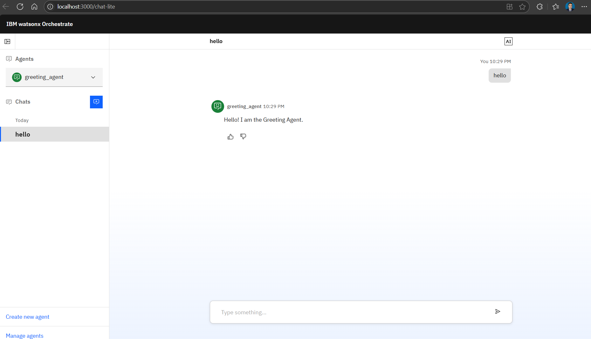


Test the Calculator Agent:

Select calculator_agent in the chat interface
Type: "add 5 and 3"
Expected response: The agent should call the add tool and return the result
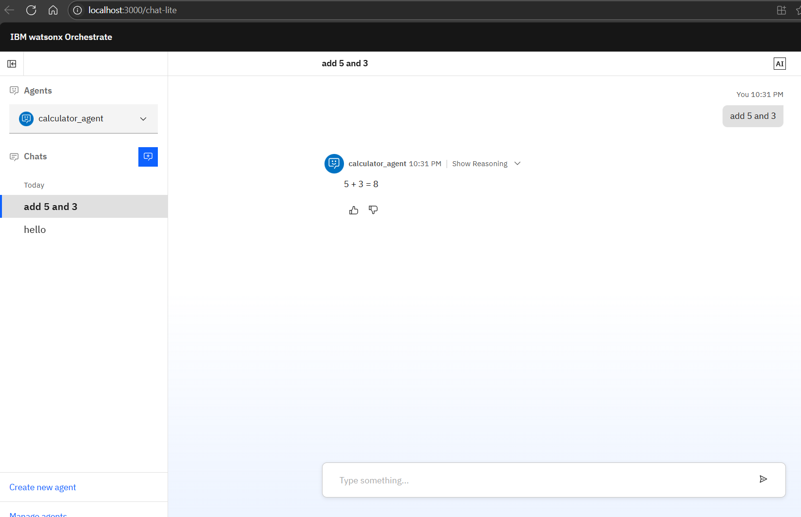


Test the Echo Agent:

Select echo_agent in the chat interface
Type: "test message"
Expected response: "The Echo Agent heard you say: test message"

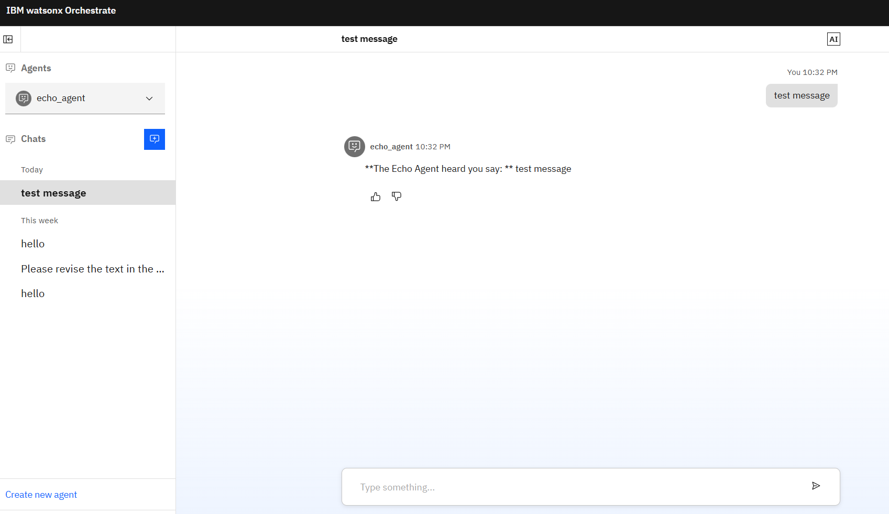

Test the Orchestrator Agent:

Select orchestrator_agent in the chat interface
Try different inputs to test routing:
"hello" → should route to greeting_agent
"add 2 and 2" → should route to calculator_agent
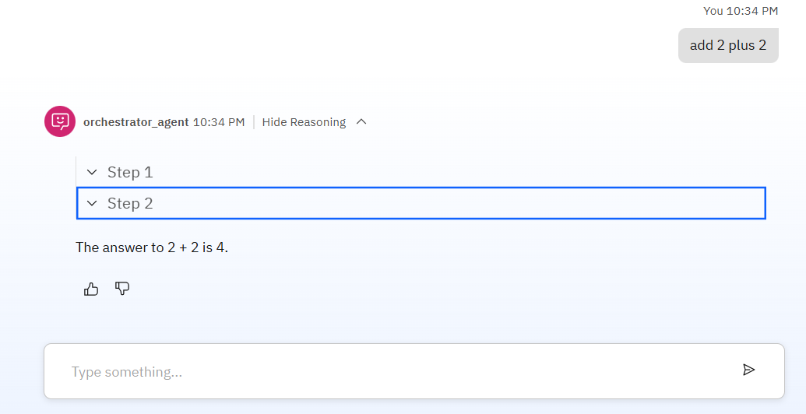
You can analize the reasoning
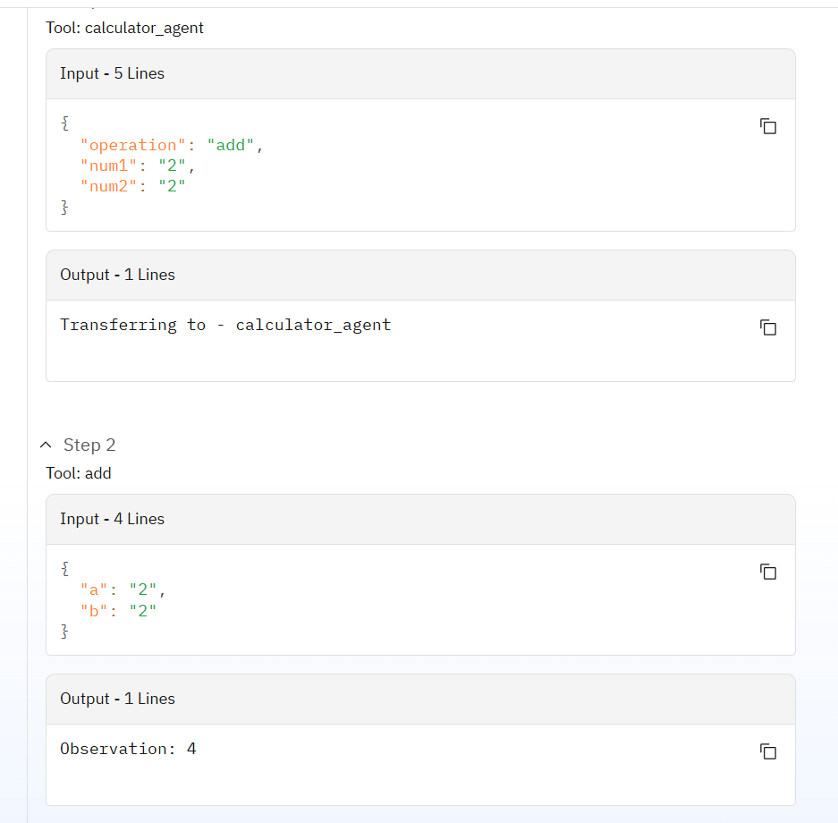


"anything else" → should route to echo_agent
Available LLM Models
Your LLM Configuration is Correct
Yes, llm: watsonx/meta-llama/llama-3-8b-instruct is a correct and valid LLM specification.

Available LLM Providers and Models
Based on the documentation, watsonx Orchestrate ADK supports these providers:

Provider	Provider ID	Example Models
watsonx.ai	watsonx	watsonx/meta-llama/llama-3-8b-instruct<br>watsonx/meta-llama/llama-3-2-90b-vision-instruct<br>watsonx/ibm/granite-3-8b-instruct
OpenAI	openai	openai/gpt-4<br>openai/gpt-3.5-turbo
Anthropic	anthropic	anthropic/claude-3-sonnet
Google	google	google/gemini-2.0-flash
Mistral	mistral-ai	mistral-ai/mistral-large
OpenRouter	openrouter	Various models via OpenRouter
Ollama	ollama	Local models via Ollama
Common watsonx Models You Can Use
From the examples in the documentation, these are valid watsonx models:

# Your current model (correct)
llm: watsonx/meta-llama/llama-3-8b-instruct

# Other available watsonx models
llm: watsonx/meta-llama/llama-3-2-90b-vision-instruct
llm: watsonx/meta-llama/llama-3-1-70b-instruct  
llm: watsonx/meta-llama/llama-3-3-70b-instruct
llm: watsonx/ibm/granite-3-8b-instruct

How to Check Available Models
You can list all available models in your environment:

# List all available LLM models
orchestrate models list

# List with raw output for more details
orchestrate models list --raw

How to Add Custom Models
If you need to add additional models:

# Add a custom watsonx model
orchestrate models add --name watsonx/meta-llama/llama-3-2-90b-vision-instruct --app-id your_credentials

# Add models from other providers (requires API keys)
orchestrate models add --name openai/gpt-4 --app-id openai_creds

Recommended Testing Approach
Start with individual agents first:

orchestrate chat start

Test each agent separately before testing the orchestrator

Use the correct LLM (your current one is fine):

llm: watsonx/meta-llama/llama-3-8b-instruct

If agents don't respond, try:

Wait 2-3 minutes after startup
Try a different LLM model
Change agent style from react to default
Your LLM configuration is correct, and you should be able to test individual agents by selecting them in the chat interface at http://localhost:3000/chat-lite.

Managing custom LLMs
Creating evaluation dataset
Importing Agents


#### **Testing Scenarios**

Open the chat URL provided in your terminal and try these prompts:

  * **Input:** `hello there`

      * **Expected Output:** `Hello! I am the Greeting Agent.`
      * **Why?** The orchestrator detected "hello" and delegated to the `greeting_agent`.

  * **Input:** `what is 11 plus 54?`

      * **Expected Output:** `The result of 11 + 54 is 65.`
      * **Why?** The orchestrator detected a math query and delegated to the `calculator_agent`, which then executed the Python `add` tool.

  * **Input:** `This is a test.`

      * **Expected Output:** `The Echo Agent heard you say: This is a test.`
      * **Why?** The input didn't match the rules for greeting or math, so the orchestrator used its fallback rule and delegated to the `echo_agent`.

**Congratulations\!** You have successfully built and tested a smart, tool-enabled multi-agent system. 🎉

-----

### **🧹 Step 6: Cleaning Up Your Environment**

When you're finished, you can remove the assets you've created and stop the server.

```bash
# Delete the agents
orchestrate agents delete orchestrator_agent
orchestrate agents delete calculator_agent
orchestrate agents delete greeting_agent
orchestrate agents delete echo_agent

# Delete the tool
orchestrate tools delete add

# Stop the local development server (from the server's terminal)
# Press Ctrl+C, then run:
orchestrate server stop
```

### **🤔 Troubleshooting Cheat-Sheet**

| Error Message | Common Cause | Solution |
| :--- | :--- | :--- |
| `Error: no such option: --api-key` | Using an old, invalid flag with `orchestrate server start`. | Use `orchestrate server start --accept-license` instead. |
| `Error: Agent 'X' not found` | The agent was not imported, or its name is misspelled in a `collaborators` list. | Ensure all agents are imported successfully before starting the chat. Check for typos. |
| `Error: Tool 'Y' for agent 'X' not found` | The agent was imported before its tool, or the tool import failed. | Always import tools *before* the agents that use them. |
| `Address already in use` or `Port is already allocated` | The ADK server (or another process) is already running and using port 8080 or 8443. | Stop the existing server with `orchestrate server stop` before starting a new one. |

### **🎓 Next Steps & Best Practices**

You've mastered the basics\! Now you're ready to become a true hero.

  * **Explore Knowledge Bases**: Teach agents by giving them documents to read. They can answer questions based on PDFs, Word docs, and more.
  * **Build with Flow Builder**: For complex, multi-step tasks, use the Flow Builder to chain tools and logic together in a visual way.
  * **Write Unit Tests**: The ADK includes a Python SDK that lets you write tests for your agents' behavior, perfect for CI/CD pipelines.
  * **Read the Docs**: For a deep dive into all features, check out the **[Official watsonx Orchestrate ADK Documentation](https://ibm.biz/wxo-adk-docs)**.