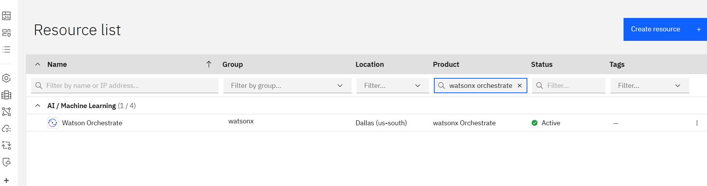

## 🚀 **From Zero to Hero: Building a Multi-Agent System with Watsonx Orchestrate**

### **Introduction**

Welcome to the world of AI agents\! In this tutorial, you'll learn how to build a **multi-agent system**. Instead of a single, monolithic AI, we will create a team of specialized agents that collaborate to solve problems. Our system will have:

  * **Greeting Agent**: A specialist for handling greetings.
  * **Echo Agent**: A simple agent that repeats any general message.
  * **Calculator Agent**: A powerful agent that can perform math using a Python tool.
  * **Orchestrator Agent**: The "manager" agent that receives all user requests and decides which specialist should handle the task.

This "manager-worker" pattern is fundamental to creating sophisticated and reliable AI systems. Let's get started\!


## Environment Configuration for watsonx Orchestrate Developer Edition

There are different ways to configure the **Watsonx Orchestrate Developer Edition** depending on your account type and requirements. This guide will walk you through the correct procedures for each configuration option.

### **Prerequisites**

Before you begin, make sure you have the following:

1.  **Python 3.11+**: Ensure Python and `pip` are installed and accessible from your command line.
2.  **Docker**: The ADK development server runs in a Docker container, so you must have Docker Desktop or another container environment (like Colima) installed and running.
3.  **IBM Cloud Account** 

-----

### **Step 1: Project Setup**

To make things easier, all the code for this tutorial is ready for you. Let's clone the repository and set up a clean Python environment.

## **Clone the Project Files**
    Open your terminal and run the following command to download all the necessary YAML and Python files.

```bash
git clone https://github.com/ruslanmv/hello-watsonx-orchestrate.git

```
we change the directory to
```bash
cd hello-watsonx-orchestrate
```
## Create virtual environment

Before configuring watsonx Orchestrate, ensure you have:
Python Virtual Environment Setup.
First, create and activate a Python virtual environment:

```bash
python -m venv venv
```
### Activate the virtual environment

On Linux/macOS:
```bash
source venv/bin/activate  
```
On Windows:
```bash
venv\Scripts\activate     
```
## Watsonx Orchestrate ADK Installation

Now, we'll install the IBM watsonx Orchestrate Agent Developer Kit (ADK) and start the local development server.

**Install the ADK**
    Use `pip` to install the core `orchestrate` library.

    ```bash
    pip install --upgrade ibm-watsonx-orchestrate==1.6.2
    ```

### File Configuration Options

There are different ways to login [watson orchestratehere](https://www.ibm.com/docs/en/watsonx/watson-orchestrate/base?topic=orchestrate-logging-in-watsonx). In particular we are going to login via cli via Orchestrate Developer Edition.

The watsonx Orchestrate Developer Edition can be configured using three main approaches. Choose the one that matches your setup:

## Option 1: Using watsonx.ai Account (Recommended for Local Development)

This option requires a watsonx.ai instance and an entitlement key from My IBM.

### Create .env file with watsonx.ai configuration
```bash
cat > .env << EOF
WO_DEVELOPER_EDITION_SOURCE=myibm
WO_ENTITLEMENT_KEY=<your_entitlement_key_from_myibm>
WATSONX_APIKEY=<your_watsonx_api_key>
WATSONX_SPACE_ID=<your_space_id>
WO_DEVELOPER_EDITION_SKIP_LOGIN=false
EOF
```
### Requirements:

- Valid watsonx.ai instance on IBM Cloud
- Entitlement key from My IBM
- watsonx.ai API key and Space ID

## Option 2: Using watsonx Orchestrate Account (Version 1.5.0+)
This is the preferred method if you have a watsonx Orchestrate account.

### Create .env file with watsonx Orchestrate configuration

```bash
cat > .env << EOF
WO_DEVELOPER_EDITION_SOURCE=orchestrate
WO_INSTANCE=<your_service_instance_url>
WO_API_KEY=<your_wxo_api_key>
EOF
```
### Requirements:

- Active watsonx Orchestrate account
- Service instance URL from your watsonx Orchestrate settings
- API key generated from watsonx Orchestrate settings

## Option 3: Hybrid Approach (Fallback Method)
Use this if Option 2 doesn't work for pulling images.

### Create .env file with hybrid configuration
```bash
cat > .env << EOF
WO_DEVELOPER_EDITION_SOURCE=myibm
WO_ENTITLEMENT_KEY=<your_entitlement_key>
WO_INSTANCE=<your_service_instance_url>
WO_API_KEY=<your_wxo_api_key>
WO_DEVELOPER_EDITION_SKIP_LOGIN=false
EOF
```

## Getting Credentials for IBM Cloud watsonx Orchestrate (Option 2)

Important: Don't use the credentials from the IBM Cloud resources page directly. Follow this specific procedure to get the correct credentials for Option 2 configuration:

### Step 1: Access Your watsonx Orchestrate Instance

Log in to your  [IBM Cloud Account](https://cloud.ibm.com/)

Log in with your IBM Cloud credentials

If you don't have an account, create an [IBM Cloud account](https://cloud.ibm.com/registration). Complete the registration form, and click Create account.
Go to your [Resources list](https://cloud.ibm.com/resources)

Navigate to the [watsonx Orchestrate catalog](https://cloud.ibm.com/catalog/services/watsonx-orchestrate?) page on IBM Cloud.


On the plan catalog page, select Trial plan and choose your data center location from the Select a location drop-down.


The Service name is pre-filled, you can modify it if needed.
The resource group is set to Default.

Accept the license agreement and click Create to provision a watsonx Orchestrate instance on IBM Cloud. The services page is displayed.

Click Launch watsonx Orchestrate to access the service page and start using the service.


Navigate to Resource list
Find your watsonx Orchestrate product under the AI/Machine Learning resource category




Click on your watsonx Orchestrate instance


Click Launch watsonx Orchestrate


## Step 2: Access API Settings
Once you're logged into your watsonx Orchestrate instance:

Click your user icon on the top right Click Settings


Go to the API details tab

## Step 3: Get Service Instance URL (WO_INSTANCE)

Copy the service instance URL from the API details tab. This will be in the format:

https://api.<region>.watson-orchestrate.ibm.com/instances/<wxo_instance_id>

Save this value for the WO_INSTANCE variable in your .env file.


## Step 4: Generate API Key (WO_API_KEY)

Click the Generate API key button

This redirects you to the IBM Cloud Identity Access Management center

Important: Verify that you are in the correct Account where you have access to watsonx Orchestrate


Click Create to create a new API Key

Enter a name and description for your API Key


Copy the API key and store it securely - this will be your WO_API_KEY value

## Step 5: Set WO_DEVELOPER_EDITION_SOURCE

For Option 2, set WO_DEVELOPER_EDITION_SOURCE=orchestrate

Important Notes:

API keys are not retrievable and can't be edited or deleted
Store your API key in a safe location immediately after generation
You're limited to 10 API keys in this environment

## Getting Credentials for IBM Cloud using watsonx.ai Account (Option 1)

Follow these steps to obtain all the required credentials for Option 1 configuration:

### Step 1: Get Entitlement Key from My IBM (WO_ENTITLEMENT_KEY)

Access [My IBM](https://myibm.ibm.com/)

Click View Library


Click Add a new key +


Copy the entitlement key - this will be your 

WO_ENTITLEMENT_KEY value


## Step 2: Create watsonx.ai Instance and Get Space ID (WATSONX_SPACE_ID)
Create a watsonx.ai instance on IBM Cloud (if you don't have one already)


Go to your [watsonx instance](https://dataplatform.cloud.ibm.com/wx/home?context=wx)


Scrow down and click [Create a new deployment space](https://
dataplatform.cloud.ibm.com/ml-runtime/spaces/create-space?context=wx)


here we give an orignal name for example 

`watsonx-ochestrate-1` 

for exmaple,


for this demo we will use Deployment stage `Development`

and we choose watsonx.ai Runtime appropiate.

and we create it.


Go to the Developer access page on IBM Cloud

Go to this page

[Developer access ](https://dataplatform.cloud.ibm.com/developer-access?context=wx)


Locate your space ID - this will be your WATSONX_SPACE_ID value
You can also create a new space if needed from this page


## Step 3: Get watsonx.ai API Key (WATSONX_APIKEY)

In your IBM Cloud account, go to Manage → Access (IAM)

Click on API keys in the left sidebar

Click Create an IBM Cloud API key


[https://cloud.ibm.com/iam/apikeys](https://cloud.ibm.com/iam/apikeys)


Enter a name and description for your API key

Click Create

Copy the API key immediately - this will be your 

WATSONX_APIKEY value

Store it securely as it cannot be retrieved later

Alternative method for API key:

Go to Managing API Keys

Follow the IBM Cloud documentation to create your API key

## Step 4: Set Additional Variables

We add to additional variables

```bash
WO_DEVELOPER_EDITION_SOURCE=myibm
```

```bash
WO_DEVELOPER_EDITION_SKIP_LOGIN=false 
```

(you can set this to true to skip ICR login if you already have the images)

So complete Option 1 .env file example:

```bash
cat > .env << EOF
WO_DEVELOPER_EDITION_SOURCE=myibm
WO_ENTITLEMENT_KEY=eyJ0eXAiOiJKV1QiLCJhbGciOiJSUzI1NiJ9...
WATSONX_APIKEY=your-ibm-cloud-api-key-here
WATSONX_SPACE_ID=12345678-1234-1234-1234-123456789abc
WO_DEVELOPER_EDITION_SKIP_LOGIN=false
EOF
```

Important Notes for Option 1:

The entitlement key is a JWT token that will be quite long
The Space ID is a UUID format identifier
The API key is your IBM Cloud API key, not a watsonx Orchestrate specific key

Make sure your IBM Cloud API key has access to the watsonx.ai service and the specified space
Starting the Developer Edition
Once your .env file is configured and your Python virtual environment is active:

### Ensure Python virtual environment is active
```bash
source venv/bin/activate
```

### Start the watsonx Orchestrate Developer Edition
```bash
orchestrate server start --env-file=.env
```


## Environment Management


### Activate local environment
After starting the server, activate the local environment:
```bash
orchestrate env activate local
```

### Environment Management Commands
List Available Environments:

```bash
orchestrate env list
```

Example output:

```bash
local                      http://localhost:4321                                                 (active)
```

Just like information if we want ran the remote environment from the cloud you can choose one of the follwoing options

## Add Remote Environment (optional):
### For IBM Cloud
For the case of IBM cloud  you can type

```bash
orchestrate env add -n my-ibm-cloud-env -u https://your-service-instance-url --type ibm_iam --activate
```
and if you want to see 

```bash
orchestrate env list
```
Example output:

```bash
my-ibm-cloud-env          https://api.watson-orchestrate.cloud.ibm.com/instances/<instance-id>
```

### For AWS

And similar for aws

```bash
orchestrate env add -n my-aws-env -u https://your-service-instance-url --type mcsp --activate

```bash
orchestrate env list
```

Example output:

```bash
my-aws-env                https://api.watson-orchestrate.ibm.com/instances/<instance-id>
```

### Switch Between Environments:

### Switch to local development environment

```bash
orchestrate env activate local
```

### Switch to remote production environment

```bash
orchestrate env activate my-ibm-cloud-env
```
## Authentication for Remote Environments:

Authenticate against remote environment (expires every 2 hours)

```bash
orchestrate env activate my-ibm-cloud-env --api-key your-api-key
```

Or authenticate interactively

```bash
orchestrate env activate my-ibm-cloud-env
```
You'll be prompted: Please enter WXO API key:

## Working with Agents and Tools
Once your environment is set up and activated, you can work with agents and tools:

### Import tools
```bash
orchestrate tools import -k python -f tools/calculator_tool.py
```
### Import agents

```bash
orchestrate agents import -f agents/greeter.yaml
```

### List imported agents and tools

```bash
orchestrate agents list
orchestrate tools list
```

### Start the chat UI

```bash
orchestrate chat start
```

The chat UI will be available at: http://localhost:3000/chat-lite

Complete Workflow Example
Here's a complete workflow from setup to running:

```bash
# 1. Activate Python virtual environment
source venv/bin/activate

# 2. Verify ADK installation
orchestrate --version

# 3. Create .env file with your credentials (choose one option from above)
cat > .env << EOF
WO_DEVELOPER_EDITION_SOURCE=orchestrate
WO_INSTANCE=https://api.us-south.watson-orchestrate.cloud.ibm.com/instances/your-instance-id
WO_API_KEY=your-api-key
EOF

# 4. Start Developer Edition
orchestrate server start --env-file=.env

# 5. In another terminal, activate Python environment and local watsonx environment
source venv/bin/activate
orchestrate env activate local

# 6. Now you can work with agents and tools
orchestrate agents list
orchestrate tools list

# 7. Start chat UI
orchestrate chat start
```


### Create and Validate Your Agents

The project you cloned contains all the agent definitions. Let's review them and learn how to validate them before use.

A best practice is to run `orchestrate validate -f <your-file.yaml>` before importing anything. This command checks for typos, incorrect model IDs, and other common errors.

#### **Agent 1: The Greeting Agent (`greeting_agent.yaml`)**

This agent's only job is to respond to greetings. Note the instructions are written to be case-insensitive.

```yaml
spec_version: v1
kind: native
name: greeting_agent
description: A friendly agent that handles greetings only.
style: react
llm: watsonx/meta-llama/llama-3-2-90b-vision-instruct
instructions: |
  You are the Greeting Agent.
  • If the user's message contains the word **“hello”** (case-insensitive),
    respond with exactly:  
      **Hello! I am the Greeting Agent.**
  • For every other input, say:  
      **I only handle greetings. Please say "hello".**
tools: []


```

*Validate it:* `orchestrate validate -f greeting_agent.yaml`

#### **Agent 2: The Echo Agent (`echo_agent.yaml`)**

This agent echoes any input back, using the correct `{input}` placeholder for the user's message.

```yaml
# echo_agent.yaml
spec_version: v1
kind: native
name: echo_agent
description: An agent that echoes the user’s input back verbatim.
style: react
llm: watsonx/meta-llama/llama-3-2-90b-vision-instruct
instructions: |
  You are the Echo Agent.
  Always repeat the user's exact input.
  Format your reply as:  
    **The Echo Agent heard you say: {input}**
tools: []

```

*Validate it:* `orchestrate validate -f echo_agent.yaml`


#### **The Collaborator Pattern**

The Orchestrator Agent will manage our other agents. It uses the `collaborators` keyword to gain access to them. The message flow looks like this:

```ascii
     User Input
          │
          ▼
┌────────────────────┐
│ Orchestrator Agent │
└────────────────────┘
          │
          ├─► If "hello" is in message... ─► ┌────────────────┐
          │                                  │ Greeting Agent │
          │                                  └────────────────┘
          │
          ├─► If message is math... ───────► ┌──────────────────┐
          │                                  │ Calculator Agent │
          │                                  └──────────────────┘
          │
          └─► Otherwise... ────────────────► ┌──────────────┐
                                             │  Echo Agent  │
                                             └──────────────┘
```

#### **Agent 3: The Orchestrator Agent (`orchestrator_agent.yaml`)**

This is the brain of our system. It contains the routing logic to delegate tasks to the correct specialist.

```yaml
# orchestrator_agent.yaml
spec_version: v1
kind: native
name: orchestrator_agent
description: Routes user requests to the appropriate specialist agent.
style: react
llm: watsonx/meta-llama/llama-3-2-90b-vision-instruct
collaborators:
  - greeting_agent
  - calculator_agent
  - echo_agent
instructions: |
  You are the Orchestrator Agent. Delegate as follows:

  1. If the user's message contains the word "hello" (case-insensitive),
     delegate to **greeting_agent**.

  2. Else if the message appears to ask for mathematical operations like:
     - Addition: "add", "plus", "sum", "+", "5 + 3"
     - Subtraction: "subtract", "minus", "-", "10 - 5"  
     - Multiplication: "multiply", "times", "*", "4 * 6"
     - Division: "divide", "/", "20 / 4"
     delegate to **calculator_agent**.

  3. Otherwise, delegate to **echo_agent**.

  Do not answer directly yourself. Always delegate to the appropriate collaborator and return their exact response.
tools: []
```

*Validate it:* `orchestrate validate -f orchestrator_agent.yaml` (This will fail for now, as it doesn't know about `calculator_agent` yet. We'll fix that next\!)

-----

### **The "Hero" Leap - Empowering Agents with Python Tools**

Agents that only talk are useful, but agents that *do things* are powerful. Here’s how we create our `calculator_agent`. **Order is critical**: we must create and import the tool *before* the agent that uses it.

#### **4.1: Create the Python Tool (`calculator_tool.py`)**

The ADK requires the `@tool` decorator to discover and register a Python function.

```python
# calculator_tool.py
from ibm_watsonx_orchestrate.agent_builder.tools import tool

@tool
def add(a: float, b: float) -> float:
    """
    Add two numbers together.
    
    :param a: The first number to add
    :param b: The second number to add
    :returns: The sum of a and b
    """
    return a + b

@tool
def subtract(a: float, b: float) -> float:
    """
    Subtract the second number from the first number.
    
    :param a: The number to subtract from
    :param b: The number to subtract
    :returns: The difference of a and b
    """
    return a - b

@tool
def multiply(a: float, b: float) -> float:
    """
    Multiply two numbers together.
    
    :param a: The first number to multiply
    :param b: The second number to multiply
    :returns: The product of a and b
    """
    return a * b

@tool
def divide(a: float, b: float) -> float:
    """
    Divide the first number by the second number.
    
    :param a: The dividend (number to be divided)
    :param b: The divisor (number to divide by)
    :returns: The quotient of a divided by b
    """
    if b == 0:
        raise ValueError("Cannot divide by zero")
    return a / b
```

#### **Create the Calculator Agent (`calculator_agent.yaml`)**

This agent is explicitly designed to use our new `add` tool.

```yaml
spec_version: v1
kind: native
name: calculator_agent
description: Performs mathematical calculations including addition, subtraction, multiplication, and division.
style: react
llm: watsonx/meta-llama/llama-3-2-90b-vision-instruct
instructions: |
  You are a calculator agent that can perform basic mathematical operations.
  
  • When asked to add or sum numbers, call the `add` tool
  • When asked to subtract numbers, call the `subtract` tool  
  • When asked to multiply numbers, call the `multiply` tool
  • When asked to divide numbers, call the `divide` tool
  
  Always use the appropriate tool for the mathematical operation requested.
  Do NOT compute results yourself - always use the tools.
  After the tool returns a result, present it clearly to the user.
  
  Handle these types of requests:
  - "add 5 and 3" or "5 + 3" → use add tool
  - "subtract 10 from 15" or "15 - 10" → use subtract tool
  - "multiply 4 by 6" or "4 * 6" → use multiply tool
  - "divide 20 by 4" or "20 / 4" → use divide tool
tools:
  - add
  - subtract
  - multiply
  - divide
```

*Validate it:* `orchestrate validate -f calculator_agent.yaml`

-----

### **Import and Test Your Multi-Agent System**

With all our files defined and validated, let's import them into Orchestrate and start chatting.

1.  **Open a NEW terminal window** (leave the server running) and activate your virtual environment.

2.  **Import the Tool First**
    Tools must exist before the agents that rely on them.

    ```bash
    orchestrate tools import -k python -f tools/calculator_tool.py
    ```

3.  **Import the Agents**
    Now import all the agents.

```bash
orchestrate agents import -f agents/greeting_agent.yaml
orchestrate agents import -f agents/calculator_agent.yaml  
orchestrate agents import -f agents/echo_agent.yaml
  ```
```bash    
# Finally import the orchestrator
orchestrate agents import -f agents/orchestrator_agent.yaml
```

4.  **Start the Chat\!**

    This command launches the chat UI. We point it to our `orchestrator_agent`, which will be the entry point. Note the plural `--agents` flag.

```bash
orchestrate chat start --agents orchestrator_agent
```


4. Check Agent Status
Verify your agents were imported correctly:
```bash
orchestrate agents list
```
5. Try Different Agent Styles
If the issue persists, try changing the style from react to default in your agent configurations, as mentioned in the known issues documentation.

6. Test Individual Agents First
Before testing the orchestrator, try testing individual agents directly to ensure they work:

Test with "hello" to see if greeting_agent responds
Test with "add 2 and 3" to see if calculator_agent responds
The most likely cause is the first interaction failure issue. Try waiting a few minutes after startup and then retry your messages. If that doesn't work, check your agent configurations and import order as described above.


Searched test individual agents chat interface agent selection available LLM models watsonx

Searched chat interface select specific agent test individual agent available models list
Based on the documentation I found, I can now provide you with comprehensive information about testing individual agents and available LLM models.

How to Test Individual Agents
1. Using the Chat Interface with Agent Selection
When you start the chat interface, you can select specific agents to test:

Start the chat interface:

orchestrate chat start

Access the chat UI:
Navigate to http://localhost:3000/chat-lite in your browser

Select a specific agent:
In the chat interface, you'll see a list of available agents. You can select the specific agent you want to test from this list.

2. Testing Individual Agents via CLI Commands
You can also test agents individually using CLI commands:

# List all available agents
orchestrate agents list

# Test a specific agent directly (if supported)
# This would show you which agents are available for testing

3. Testing Each of Your Agents
For your specific project, test each agent individually:

Test the Greeting Agent:

Select greeting_agent in the chat interface
Type: "hello"
Expected response: "Hello! I am the Greeting Agent."


Test the Calculator Agent:

Select calculator_agent in the chat interface
Type: "add 5 and 3"
Expected response: The agent should call the add tool and return the result


Test the Echo Agent:

Select echo_agent in the chat interface
Type: "test message"
Expected response: "The Echo Agent heard you say: test message"


Test the Orchestrator Agent:

Select orchestrator_agent in the chat interface
Try different inputs to test routing:
"hello" → should route to greeting_agent
"add 2 and 2" → should route to calculator_agent

You can analize the reasoning


"anything else" → should route to echo_agent
Available LLM Models
Your LLM Configuration is Correct
Yes, llm: watsonx/meta-llama/llama-3-8b-instruct is a correct and valid LLM specification.

Available LLM Providers and Models
Based on the documentation, watsonx Orchestrate ADK supports these providers:

Provider	Provider ID	Example Models
watsonx.ai	watsonx	watsonx/meta-llama/llama-3-8b-instruct<br>watsonx/meta-llama/llama-3-2-90b-vision-instruct<br>watsonx/ibm/granite-3-8b-instruct
OpenAI	openai	openai/gpt-4<br>openai/gpt-3.5-turbo
Anthropic	anthropic	anthropic/claude-3-sonnet
Google	google	google/gemini-2.0-flash
Mistral	mistral-ai	mistral-ai/mistral-large
OpenRouter	openrouter	Various models via OpenRouter
Ollama	ollama	Local models via Ollama
Common watsonx Models You Can Use
From the examples in the documentation, these are valid watsonx models:

# Your current model (correct)
llm: watsonx/meta-llama/llama-3-8b-instruct

# Other available watsonx models
llm: watsonx/meta-llama/llama-3-2-90b-vision-instruct
llm: watsonx/meta-llama/llama-3-1-70b-instruct  
llm: watsonx/meta-llama/llama-3-3-70b-instruct
llm: watsonx/ibm/granite-3-8b-instruct

How to Check Available Models
You can list all available models in your environment:

# List all available LLM models
orchestrate models list

# List with raw output for more details
orchestrate models list --raw

How to Add Custom Models
If you need to add additional models:

# Add a custom watsonx model
orchestrate models add --name watsonx/meta-llama/llama-3-2-90b-vision-instruct --app-id your_credentials

# Add models from other providers (requires API keys)
orchestrate models add --name openai/gpt-4 --app-id openai_creds

Recommended Testing Approach
Start with individual agents first:

orchestrate chat start

Test each agent separately before testing the orchestrator

Use the correct LLM (your current one is fine):

llm: watsonx/meta-llama/llama-3-8b-instruct

If agents don't respond, try:

Wait 2-3 minutes after startup
Try a different LLM model
Change agent style from react to default
Your LLM configuration is correct, and you should be able to test individual agents by selecting them in the chat interface at http://localhost:3000/chat-lite.

Managing custom LLMs
Creating evaluation dataset
Importing Agents


#### **Testing Scenarios**

Open the chat URL provided in your terminal and try these prompts:

  * **Input:** `hello there`

      * **Expected Output:** `Hello! I am the Greeting Agent.`
      * **Why?** The orchestrator detected "hello" and delegated to the `greeting_agent`.

  * **Input:** `what is 11 plus 54?`

      * **Expected Output:** `The result of 11 + 54 is 65.`
      * **Why?** The orchestrator detected a math query and delegated to the `calculator_agent`, which then executed the Python `add` tool.

  * **Input:** `This is a test.`

      * **Expected Output:** `The Echo Agent heard you say: This is a test.`
      * **Why?** The input didn't match the rules for greeting or math, so the orchestrator used its fallback rule and delegated to the `echo_agent`.

**Congratulations\!** You have successfully built and tested a smart, tool-enabled multi-agent system. 🎉

-----

### **🧹 Step 6: Cleaning Up Your Environment**

When you're finished, you can remove the assets you've created and stop the server.

```bash
# Delete the agents
orchestrate agents delete orchestrator_agent
orchestrate agents delete calculator_agent
orchestrate agents delete greeting_agent
orchestrate agents delete echo_agent

# Delete the tool
orchestrate tools delete add

# Stop the local development server (from the server's terminal)
# Press Ctrl+C, then run:
orchestrate server stop
```

### **🤔 Troubleshooting Cheat-Sheet**

| Error Message | Common Cause | Solution |
| :--- | :--- | :--- |
| `Error: no such option: --api-key` | Using an old, invalid flag with `orchestrate server start`. | Use `orchestrate server start --accept-license` instead. |
| `Error: Agent 'X' not found` | The agent was not imported, or its name is misspelled in a `collaborators` list. | Ensure all agents are imported successfully before starting the chat. Check for typos. |
| `Error: Tool 'Y' for agent 'X' not found` | The agent was imported before its tool, or the tool import failed. | Always import tools *before* the agents that use them. |
| `Address already in use` or `Port is already allocated` | The ADK server (or another process) is already running and using port 8080 or 8443. | Stop the existing server with `orchestrate server stop` before starting a new one. |

### **🎓 Next Steps & Best Practices**

You've mastered the basics\! Now you're ready to become a true hero.

  * **Explore Knowledge Bases**: Teach agents by giving them documents to read. They can answer questions based on PDFs, Word docs, and more.
  * **Build with Flow Builder**: For complex, multi-step tasks, use the Flow Builder to chain tools and logic together in a visual way.
  * **Write Unit Tests**: The ADK includes a Python SDK that lets you write tests for your agents' behavior, perfect for CI/CD pipelines.
  * **Read the Docs**: For a deep dive into all features, check out the **[Official watsonx Orchestrate ADK Documentation](https://ibm.biz/wxo-adk-docs)**.