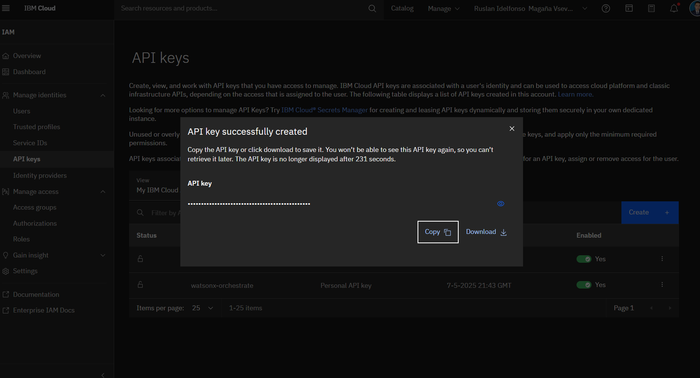

## 🚀 **From Zero to Hero: Building a Multi-Agent System with Watsonx Orchestrate**

### **Introduction**

Welcome to the world of AI agents\! In this tutorial, you'll learn how to build a **multi-agent system**. Instead of a single, monolithic AI, we will create a team of specialized agents that collaborate to solve problems. Our system will have:

  * **Greeting Agent**: A specialist for handling greetings.
  * **Echo Agent**: A simple agent that repeats any general message.
  * **Calculator Agent**: A powerful agent that can perform math using a Python tool.
  * **Orchestrator Agent**: The "manager" agent that receives all user requests and decides which specialist should handle the task.

This "manager-worker" pattern is fundamental to creating sophisticated and reliable AI systems. Let's get started\!

### **✅ Prerequisites**

Before you begin, make sure you have the following:

1.  **Python 3.8+**: Ensure Python and `pip` are installed and accessible from your command line.
2.  **Docker**: The ADK development server runs in a Docker container, so you must have Docker Desktop or another container environment (like Colima) installed and running.
3.  **IBM Cloud Account (Optional)**: While the local server runs with offline "stub" models, connecting to `watsonx.ai` gives you access to powerful LLMs like Llama 3. If you choose to connect, you'll need a project and an API key.

-----

### **🛠️ Step 1: Project Setup**

To make things easier, all the code for this tutorial is ready for you. Let's clone the repository and set up a clean Python environment.

1.  **Clone the Project Files**
    Open your terminal and run the following command to download all the necessary YAML and Python files.

    ```bash
    # This is a placeholder URL for the example.
    git clone https://github.com/example/hello-watsonx-orchestrate.git
    cd hello-watsonx-orchestrate
    ```

2.  **Create and Activate a Virtual Environment**
    A virtual environment keeps your project's dependencies isolated.

    *On macOS / Linux:*

    ```bash
    python3.11 -m venv venv
    source venv/bin/activate
    ```

    *On Windows (Command Prompt):*

    ```bash
    python -m venv venv
    venv\Scripts\activate.bat
    ```

### **⚙️ Step 2: Install and Configure the ADK**

Now, we'll install the IBM watsonx Orchestrate Agent Developer Kit (ADK) and start the local development server.

1.  **Install the ADK**
    Use `pip` to install the core `orchestrate` library.

    ```bash
    pip install --upgrade ibm-watsonx-orchestrate==1.6.2
    ```

2.  **Activate and Start the Local Server**
    The ADK's local server runs in Docker and provides an offline environment for development.

   Let's test the installation

    ```bash
   orchestrate --version
    ```
    


    In this demo we are going to use the the watsonx Orchestrate Developer Edition runs under a Docker container, and can’t be used to host a full working version of watsonx Orchestrate. 
    The server runs under the host machine’s localhost, and can’t be used to provide remote access. 

    Deploying the watsonx Orchestrate Developer Edition in a virtual machine is also not supported.


Install Docker and Docker Compose engine. It is containerization engine used to install the watsonx Orchestrate Developer Edition. For more information, see Docker and Docker compose.


For macOS users, use a container management software such as Rancher Desktop or Colima to use the Docker engine.


You must have access to at least one of these services:

watsonx Orchestrate
watsonx.ai
You can use at least one of these services to get access to the watsonx Orchestrate Developer Edition images.


Setup the environment
The watsonx Orchestrate Developer Edition is distributed as a Docker image. In order to pull the images from Docker, you must configure an environment file with the appropriate data.


Getting an entitlement key for watsonx Orchestrate Developer Edition
You can download the images if you have a valid instance of watsonx.ai. In order to do that, you must obtain an entitlement key to proceed. To get the entitlement key, follow these steps:

Access My IBM.

Click View Library.


Click Add a new key +.


Copy the entitlement key.


Using your watsonx.ai account
Create a watsonx.ai instance on IBM Cloud, if you do not have one already, and locate your space ID. You can create a new instance and get the space ID in the Developer access page on IBM Cloud.
Go to this page
[Developer access ](https://dataplatform.cloud.ibm.com/developer-access?context=wx)


To get your API Key, see[Managing API Keys](https://cloud.ibm.com/docs/account?topic=account-userapikey&interface=ui).

Create you personal API KEY
[https://cloud.ibm.com/iam/apikeys](https://cloud.ibm.com/iam/apikeys)

and copy it



    Create a .env file with the following contents:
    ```bash
  WO_DEVELOPER_EDITION_SOURCE=myibm
  WO_ENTITLEMENT_KEY=<my_entitlement_key>
  WATSONX_APIKEY=<my_watsonx_api_key>
  WATSONX_SPACE_ID=<my_space_id>
  WO_DEVELOPER_EDITION_SKIP_LOGIN=false
    ```

    ```bash
    # Point the CLI to your local environment
    orchestrate env activate local

    # Start the server and accept the license
    orchestrate server start --accept-license
    ```

    **Important**: Keep this terminal window open\! The server must be running for your agents to work. If you accidentally close it, simply run the `orchestrate server start --accept-license` command again in a new terminal.


If you want get an online watsonx orchestrate you can try the trial
Trial access on IBM Cloud.
IBM Cloud

To initiate the trial access on IBM Cloud:

[Log in](https://cloud.ibm.com/login) to your IBM Cloud account.
If you don't have an account, create an [IBM Cloud account](https://cloud.ibm.com/registration). Complete the registration form, and click Create account.
Navigate to the [watsonx Orchestrate catalog](https://cloud.ibm.com/catalog/services/watsonx-orchestrate?catalog_query=aHR0cHM6Ly9jbG91ZC5pYm0uY29tL2NhdGFsb2cjYWxsX3Byb2R1Y3Rz) page on IBM Cloud.
On the plan catalog page, select Trial plan and choose your data center location from the Select a location drop-down.


The Service name is pre-filled, you can modify it if needed.
The resource group is set to Default.
Accept the license agreement and click Create to provision a watsonx Orchestrate instance on IBM Cloud. The services page is displayed.
Click Launch watsonx Orchestrate to access the service page and start using the service.


https://us-south.watson-orchestrate.cloud.ibm.com/chat


 There are different ways to use watson orchestrate, more information [here](https://www.ibm.com/docs/en/watsonx/watson-orchestrate/base?topic=orchestrate-logging-in-watsonx)

 Using your watsonx Orchestrate account
Starting at version 1.5.0, you can now use your watsonx Orchestrate account to pull images from Docker, and you no longer need an entitlement key to pull the images.

[Log in](https://www.ibm.com/docs/en/watsonx/watson-orchestrate/current?topic=orchestrate-logging-in-watsonx) to your watsonx Orchestrate account.

Click your user profile and open the Settings page.

Open the API details tab and click Generate API key.


Installing the watsonx Orchestrate Developer Edition with ADK

To install the watsonx Orchestrate Developer Edition with the ADK, run the following command in the CLI:

```bash
orchestrate server start --env-file={{The path of your .env file}}
```

for example

orchestrate server start --env-file=/mnt/c/blog/hello-watsonx-agents/.env
-----

### **🤖 Step 3: Create and Validate Your Agents**

The project you cloned contains all the agent definitions. Let's review them and learn how to validate them before use.

A best practice is to run `orchestrate validate -f <your-file.yaml>` before importing anything. This command checks for typos, incorrect model IDs, and other common errors.

#### **Agent 1: The Greeting Agent (`greeting_agent.yaml`)**

This agent's only job is to respond to greetings. Note the instructions are written to be case-insensitive.

```yaml
# greeting_agent.yaml
spec_version: v1
kind: native
name: greeting_agent
description: A friendly agent that handles greetings.
llm: watsonx/meta-llama/llama-3-8b-instruct
instructions: |
  If the user's message contains the word "hello" (case-insensitive), you MUST respond with: "Hello! I am the Greeting Agent."
tools: []
```

*Validate it:* `orchestrate validate -f greeting_agent.yaml`

#### **Agent 2: The Echo Agent (`echo_agent.yaml`)**

This agent echoes any input back, using the correct `{input}` placeholder for the user's message.

```yaml
# echo_agent.yaml
spec_version: v1
kind: native
name: echo_agent
description: An agent that echoes back the user's message.
llm: watsonx/meta-llama/llama-3-8b-instruct
instructions: |
  Your task is to repeat the user's exact input back to them.
  You MUST respond with the format: "The Echo Agent heard you say: {input}"
tools: []
```

*Validate it:* `orchestrate validate -f echo_agent.yaml`

#### **The Collaborator Pattern**

The Orchestrator Agent will manage our other agents. It uses the `collaborators` keyword to gain access to them. The message flow looks like this:

```ascii
     User Input
          │
          ▼
┌────────────────────┐
│ Orchestrator Agent │
└────────────────────┘
          │
          ├─► If "hello" is in message... ─► ┌────────────────┐
          │                                  │ Greeting Agent │
          │                                  └────────────────┘
          │
          ├─► If message is math... ────────► ┌──────────────────┐
          │                                  │ Calculator Agent │
          │                                  └──────────────────┘
          │
          └─► Otherwise... ─────────────────► ┌──────────────┐
                                             │  Echo Agent  │
                                             └──────────────┘
```

#### **Agent 3: The Orchestrator Agent (`orchestrator_agent.yaml`)**

This is the brain of our system. It contains the routing logic to delegate tasks to the correct specialist.

```yaml
# orchestrator_agent.yaml
spec_version: v1
kind: native
name: orchestrator_agent
description: The main agent that routes tasks to the correct collaborator.
llm: watsonx/meta-llama/llama-3-8b-instruct
collaborators:
  - greeting_agent
  - echo_agent
  - calculator_agent
instructions: |
  You are a router. Your job is to delegate tasks to the appropriate agent based on these rules:
  - If the user's message contains the word "hello" (case-insensitive), delegate to the `greeting_agent`.
  - If the user's message involves math, calculation, or adding numbers, delegate to the `calculator_agent`.
  - For ALL other inputs, delegate to the `echo_agent`.
  Do not answer directly. Only delegate.
tools: []
```

*Validate it:* `orchestrate validate -f orchestrator_agent.yaml` (This will fail for now, as it doesn't know about `calculator_agent` yet. We'll fix that next\!)

-----

### **🦸 Step 4: The "Hero" Leap - Empowering Agents with Python Tools**

Agents that only talk are useful, but agents that *do things* are powerful. Here’s how we create our `calculator_agent`. **Order is critical**: we must create and import the tool *before* the agent that uses it.

#### **4.1: Create the Python Tool (`calculator_tool.py`)**

The ADK requires the `@tool` decorator to discover and register a Python function.

```python
# calculator_tool.py
from orchestrate_sdk import tool
from typing import Annotated
from pydantic import Field

@tool(name="add", description="A tool to add two numbers.")
def add(a: Annotated[int, Field(description="The first number to add")],
        b: Annotated[int, Field(description="The second number to add")]) -> str:
  """
  Adds two numbers together and returns the result as a string.
  Use this tool for any addition calculation.
  """
  result = a + b
  return f"The result of {a} + {b} is {result}."
```

#### **4.2: Create the Calculator Agent (`calculator_agent.yaml`)**

This agent is explicitly designed to use our new `add` tool.

```yaml
# calculator_agent.yaml
spec_version: v1
kind: native
name: calculator_agent
description: An agent that can perform addition.
llm: watsonx/meta-llama/llama-3-8b-instruct
instructions: |
  You are a calculator. When asked to add numbers, you MUST use the `add` tool.
tools:
  - add
```

*Validate it:* `orchestrate validate -f calculator_agent.yaml`

-----

### **▶️ Step 5: Import and Test Your Multi-Agent System**

With all our files defined and validated, let's import them into Orchestrate and start chatting.

1.  **Open a NEW terminal window** (leave the server running) and activate your virtual environment.

2.  **Import the Tool First**
    Tools must exist before the agents that rely on them.

    ```bash
    orchestrate tools import -k python -f calculator_tool.py
    ```

3.  **Import the Agents**
    Now import all the agents.

    ```bash
    orchestrate agents import -f greeting_agent.yaml
    orchestrate agents import -f echo_agent.yaml
    orchestrate agents import -f calculator_agent.yaml
    orchestrate agents import -f orchestrator_agent.yaml
    ```

4.  **Start the Chat\!**
    This command launches the chat UI. We point it to our `orchestrator_agent`, which will be the entry point. Note the plural `--agents` flag.

    ```bash
    orchestrate chat start --agents orchestrator_agent
    ```

#### **Testing Scenarios**

Open the chat URL provided in your terminal and try these prompts:

  * **Input:** `hello there`

      * **Expected Output:** `Hello! I am the Greeting Agent.`
      * **Why?** The orchestrator detected "hello" and delegated to the `greeting_agent`.

  * **Input:** `what is 11 plus 54?`

      * **Expected Output:** `The result of 11 + 54 is 65.`
      * **Why?** The orchestrator detected a math query and delegated to the `calculator_agent`, which then executed the Python `add` tool.

  * **Input:** `This is a test.`

      * **Expected Output:** `The Echo Agent heard you say: This is a test.`
      * **Why?** The input didn't match the rules for greeting or math, so the orchestrator used its fallback rule and delegated to the `echo_agent`.

**Congratulations\!** You have successfully built and tested a smart, tool-enabled multi-agent system. 🎉

-----

### **🧹 Step 6: Cleaning Up Your Environment**

When you're finished, you can remove the assets you've created and stop the server.

```bash
# Delete the agents
orchestrate agents delete orchestrator_agent
orchestrate agents delete calculator_agent
orchestrate agents delete greeting_agent
orchestrate agents delete echo_agent

# Delete the tool
orchestrate tools delete add

# Stop the local development server (from the server's terminal)
# Press Ctrl+C, then run:
orchestrate server stop
```

### **🤔 Troubleshooting Cheat-Sheet**

| Error Message | Common Cause | Solution |
| :--- | :--- | :--- |
| `Error: no such option: --api-key` | Using an old, invalid flag with `orchestrate server start`. | Use `orchestrate server start --accept-license` instead. |
| `Error: Agent 'X' not found` | The agent was not imported, or its name is misspelled in a `collaborators` list. | Ensure all agents are imported successfully before starting the chat. Check for typos. |
| `Error: Tool 'Y' for agent 'X' not found` | The agent was imported before its tool, or the tool import failed. | Always import tools *before* the agents that use them. |
| `Address already in use` or `Port is already allocated` | The ADK server (or another process) is already running and using port 8080 or 8443. | Stop the existing server with `orchestrate server stop` before starting a new one. |

### **🎓 Next Steps & Best Practices**

You've mastered the basics\! Now you're ready to become a true hero.

  * **Explore Knowledge Bases**: Teach agents by giving them documents to read. They can answer questions based on PDFs, Word docs, and more.
  * **Build with Flow Builder**: For complex, multi-step tasks, use the Flow Builder to chain tools and logic together in a visual way.
  * **Write Unit Tests**: The ADK includes a Python SDK that lets you write tests for your agents' behavior, perfect for CI/CD pipelines.
  * **Read the Docs**: For a deep dive into all features, check out the **[Official watsonx Orchestrate ADK Documentation](https://ibm.biz/wxo-adk-docs)**.